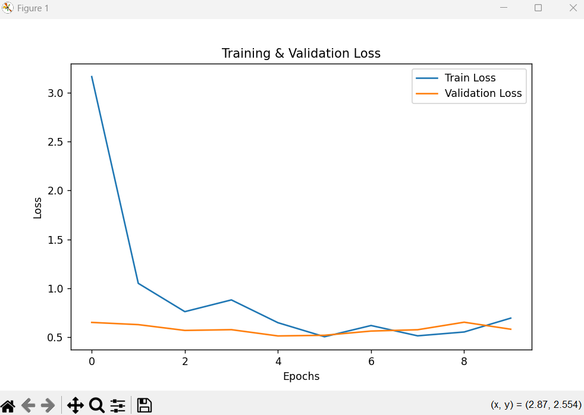
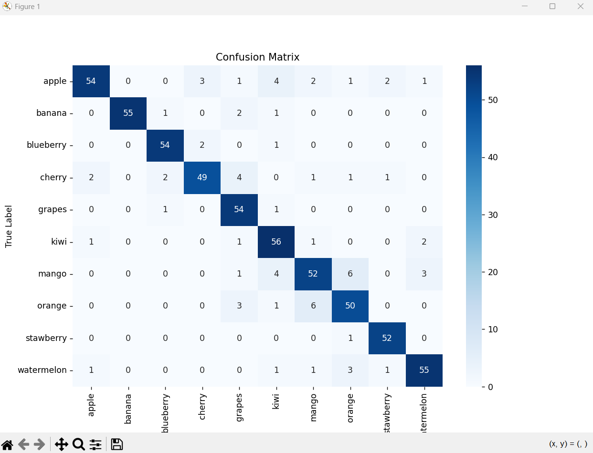
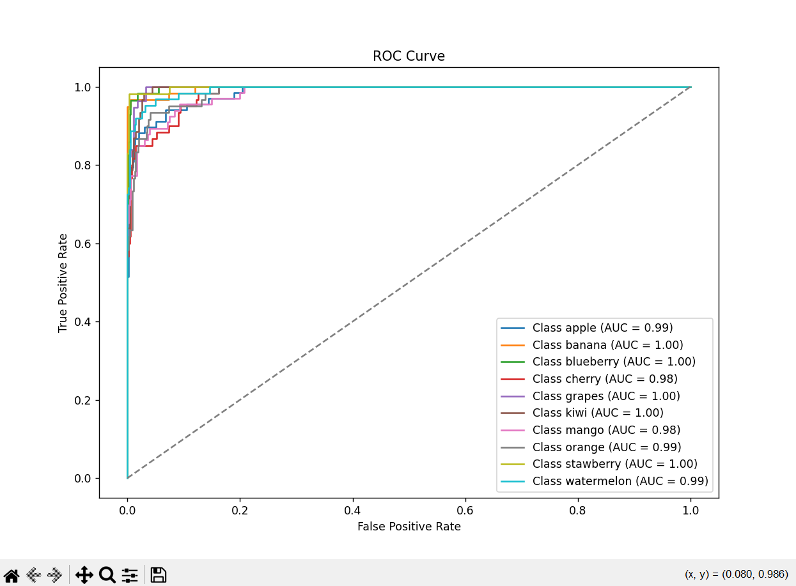
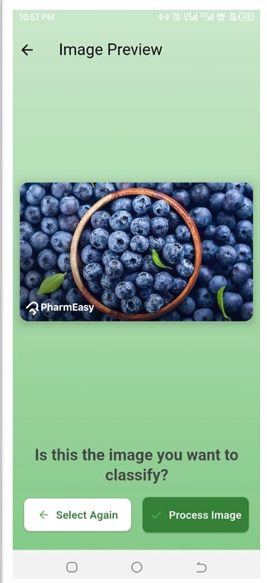
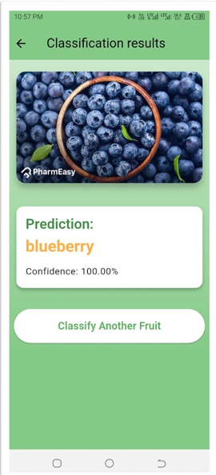

# InceptionV3 Fruit Image Classifier

This project uses a custom dataset of 10 fruits to build an image classifier using the **InceptionV3** model. The dataset is collected from Google Images and includes the following classes:

- **Apple**: 451 images
- **Banana**: 391 images
- **Blueberry**: 381 images
- **Cherry**: 401 images
- **Grapes**: 375 images
- **Kiwi**: 408 images
- **Mango**: 437 images
- **Orange**: 403 images
- **Strawberry**: 357 images
- **Watermelon**: 417 images

## Dataset Details
- **Data Augmentation**: Applied (rotation, width/height shift, shear, zoom, horizontal flip)
- **Data Split**: 70% training, 15% validation, 15% testing
- **Model**: InceptionV3 pre-trained on ImageNet with custom layers for classification
- **Accuracy**: 92% test accuracy

## Model Details

### InceptionV3
InceptionV3 is a deep convolutional neural network architecture designed to work efficiently for image classification tasks. It combines multiple convolutional filters at different scales, known as the **Inception module**, which allows the network to learn from varying levels of granularity. It was pre-trained on ImageNet and used as the base model for this project.

### Hyperparameters
- **Learning Rate**: 0.001 for initial training, 0.0001 for fine-tuning
- **Optimizer**: Adam
- **Loss Function**: Sparse categorical cross-entropy
- **Batch Size**: 64
- **Epochs**: 20 (10 initial epochs, followed by fine-tuning for 10 more)
- **Model**: InceptionV3 with additional layers of **GlobalAveragePooling2D**, **Dense(1024, relu)**, and **Dense(n_classes, softmax)**

## Results
- **Training & Validation Loss**: 
- **Confusion Matrix**: 
- **ROC Curve**: 

## App Description

This image classifier is deployed in a **Flutter app** using **TensorFlow Lite** for real-time fruit image classification. The app allows users to upload images of fruits, and the model will classify them into one of the 10 fruit classes. The app provides an intuitive user interface to interact with the model and view classification results instantly.

### Features
- Real-time image classification
- Simple user interface for uploading images
- High accuracy with 92% test accuracy
- Deployed using TensorFlow Lite for mobile optimization
## App Code
The code for the app can be accessed at [Fruit Image Classifier](https://github.com/IkramMehmmod/image-classifier.git).

### App Screenshots
Here are some screenshots of the app:
1. 
2. 

## Files
- [Google Drive Link for dataset](https://drive.google.com/drive/folders/1Cy5sXSgSSr3ufAynCwFK0rhIOiL3F4Hg?usp=sharing)

## Setup and Usage

1. Clone the repository:
   ```bash
   git clone https://github.com/AliAhmed015/InceptionV3-Fruit-Image-Classifier-Using-a-Random-Dataset.git
